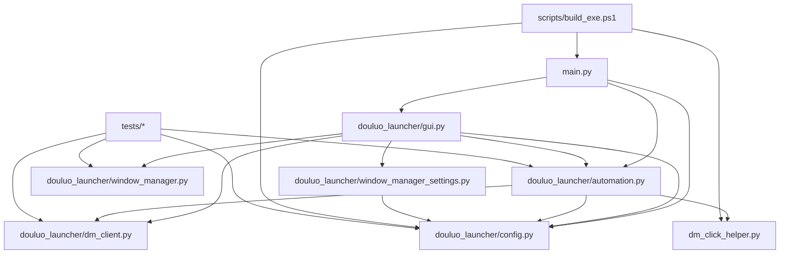

# 上号器项目健康检查报告

生成时间：2026-05-23  
检查范围：`D:\Ai\codex\上号器`  
检查性质：只读项目分析；除本报告外未修改业务代码。

## 0. 执行规则与工具状态

- 已读取项目 `AGENTS.md`。
- 已按总控规则读取 `D:\Ai\skills\codex-skills\codebase-recon\SKILL.md`。
- 已按 `codebase-recon` 规则执行 git 历史探测。
- `brooks-lint` 顶层 `SKILL.md` 不存在，但已读取并使用 `D:\Ai\skills\codex-skills\brooks-lint\brooks-health\SKILL.md`、共享规则和 `health-guide.md` 做只读工程质量审查。
- MCP 状态已验证：
  - `context7`：enabled，入口 `D:\Ai\skills\mcp-servers\bin\context7-mcp.cmd`
  - `playwright`：enabled，入口 `D:\Ai\skills\mcp-servers\bin\playwright-mcp.cmd`
- 本项目是 Tkinter 桌面程序，本次未使用 Playwright MCP 测试桌面 UI。
- 涉及 Playwright/PyInstaller 运行时风险时，已使用 Context7 查询官方文档要点。PyInstaller 文档确认：打包运行时可用 `sys.frozen`、`sys._MEIPASS`、`__file__` 区分 bundle 资源路径；本项目当前采用 `app_root()` / `project_root()` 分流，需要持续保持源码/exe一致性。
- 已执行 `code-review-graph build`，结果：16 files，379 nodes，4602 edges。
- 已执行单元测试：`python -m unittest discover -s tests -v`，23 tests OK。

## 1. 项目当前状态

项目处于“前台串行阶段性完成版”：

- 方式一：通行证上号已验证通过。
- 方式二：账号密码 + 通行证上号已验证通过。
- 当前主流程仍是前台串行，不是真后台、不是真并发。
- 通行证获取策略为复制优先，OCR 兜底。
- OCR 低置信度和 `c/e` 混淆不能直接接受。
- 已登录窗口、公告界面、游戏界面必须优先识别为 `logged_in`，不能继续 OCR。
- `qr_page`、`unknown`、截图失败都不能判成功。
- 当前层串行 / 全部串行已使用“批量快速登录 + 统一校验 + 失败重登”。
- 文件级通行证弹窗坐标缓存已生效。
- 合并 Dm chain 已生效。
- 固定参数排列和行数列数排列已支持。
- 单层账号和四层账号已隔离。
- 停止任务和关闭程序清理子进程已修复。
- 源码模式和 exe 模式均已做过当前阶段验证。
- 已新增 `D:\Ai\skills\launcher-regression-guard\SKILL.md` 防回归技能。

## 2. git 状态

当前分支：`main`

最近提交：

- `23cae1f 阶段完成：上号器前台串行稳定收尾版`
- `cb241e1 阶段完成：修复批量已登录分类并更新文档`
- `bced4da 阶段完成：修复登录识别并稳定打包流程`

当前 `git status --short` 仅显示未跟踪文件：

```text
?? AGENTS.md
?? debug_ocr/m2_notice_after_1.png
?? debug_ocr/m2_notice_after_2.png
?? debug_ocr/m2_notice_before_1.png
?? debug_ocr/m2_notice_before_2.png
?? debug_ocr/passport_dialog_pos_cache.json
?? window_manager_settings.json
?? 大号游戏账号.csv
```

## 3. 未跟踪文件分析

| 文件 | 判断 | 建议 |
|---|---|---|
| `AGENTS.md` | 项目级 Codex/MCP 调用规则，当前未跟踪 | 如确认要长期作为项目规则，应单独提交；否则保持本地也可 |
| `debug_ocr/m2_notice_*.png` | 方式二公告调试截图 | 运行产物，不提交 |
| `debug_ocr/passport_dialog_pos_cache.json` | 通行证弹窗坐标缓存 | 本地运行缓存，不提交 |
| `window_manager_settings.json` | 窗口管理本地参数 | 本地配置，不提交 |
| `大号游戏账号.csv` | 本地账号数据 | 含敏感业务数据，不提交 |

## 4. codebase-recon 摘要

Repo Vitals: Age: 2026-05-11 to 2026-05-17 | Commits: 17 | Branches: 2 | Analysis window: all time

### Code Hotspots

| 次数 | 文件 |
|---:|---|
| 15 | `douluo_launcher/automation.py` |
| 10 | `douluo_launcher/gui.py` |
| 10 | `CURRENT_ISSUES.md` |
| 9 | `README.md` |
| 9 | `NEXT_STEPS.md` |
| 7 | `BUILD.md` |
| 7 | `DEVELOPMENT_RULES.md` |
| 5 | `automation_settings.json` |
| 5 | `OCR_SUCCESS.md` |
| 5 | `CLICK_SOLUTION.md` |

### Bug Magnets

| 次数 | 文件 |
|---:|---|
| 10 | `douluo_launcher/automation.py` |
| 6 | `douluo_launcher/gui.py` |
| 6 | `CURRENT_ISSUES.md` |
| 5 | `BUILD.md` |
| 5 | `README.md` |
| 5 | `NEXT_STEPS.md` |
| 4 | `dm_click_helper.py` |
| 3 | `automation_settings.json` |
| 3 | `DEVELOPMENT_RULES.md` |
| 3 | `KNOWN_BUGS.md` |

### High-Risk Files

同时出现在 Hotspots 与 Bug Magnets 的最高风险文件：

- `douluo_launcher/automation.py`：最高风险。承载登录主流程、通行证复制/OCR、状态判断、Playwright、Dm 调用、统一校验。
- `douluo_launcher/gui.py`：高风险。承载 Tkinter UI、批量流程、子进程隔离、停止清理、窗口管理入口。
- `dm_click_helper.py`：中高风险。32 位大漠点击子进程，真实移动鼠标。
- `automation_settings.json`：配置风险。参数变化会直接影响 OCR、点击、等待、校验。
- 打包文档和脚本相关文件：exe/source 一致性风险高。

Bus Factor：当前 git 历史显示 1 名贡献者，知识集中度高。  
Momentum：17 个提交全部集中在 2026-05，属于短周期高强度迭代，风险是历史经验和回归规则主要靠文档约束。

## 5. 核心入口文件

- `main.py`
  - 管理员权限检测与 UAC 重启。
  - `--diagnose-runtime` exe/source 路径诊断。
  - `--run-account-action` 子进程账号执行入口。
  - 正常 GUI 入口：`LauncherApp().mainloop()`。
- `douluo_launcher/gui.py`
  - Tkinter 主窗口。
  - 方式一/方式二 UI。
  - 窗口管理区。
  - 单账号、当前层串行、全部串行调度。
  - 子进程管理、停止清理、日志写入。
- `douluo_launcher/automation.py`
  - `AccountRunner`。
  - 方式一完整登录、快速提交、统一校验。
  - 方式二账号密码 + 通行证流程。
  - 通行证复制/OCR、登录状态判断、Dm chain 调用。

## 6. 核心流程列表

1. 启动流程：
   - `main.py` 检查管理员权限。
   - 非管理员时请求 UAC 重启。
   - 初始化 `LauncherApp`。

2. 方式一单账号：
   - 定位登录程序窗口。
   - 判断 `logged_in` / `qr_page` / `unknown`。
   - `qr_page` 时复制优先获取通行证，失败才 OCR。
   - 打开浏览器游戏页。
   - 关闭公告。
   - Dm 点击通行证按钮、输入、确认。
   - 完整登录校验。

3. 当前层串行 / 全部串行：
   - 快速提交阶段区分 `already_logged_in` / `submitted` / `failed`。
   - `already_logged_in` 直接成功，不进入 OCR 和统一校验。
   - `submitted` 进入统一校验。
   - 失败账号按重新次数只重登失败账号。

4. 方式二：
   - 从登录窗口获取通行证。
   - Playwright 打开 CSV URL。
   - 输入用户名/密码。
   - 关闭公告。
   - Dm 输入通行证并确认。
   - 校验登录程序窗口状态。

5. 窗口管理：
   - 批量启动、识别、排列、关闭、重命名。
   - 固定参数排列与行数列数排列参数分开记忆。
   - 视觉排列不改变账号窗口号映射。

## 7. 稳定模块清单

这些模块已稳定，除非有明确 bug 和测试计划，不建议修改：

- `douluo_launcher/automation.py` 中已稳定的通行证复制优先逻辑。
- `detect_login_page_state()` 三态判断硬规则。
- OCR 低置信度与 `c/e` 混淆拦截。
- 已登录跳过和 `already_logged_in` 分类。
- Dm chain 输入/确认链路。
- `dm_click_helper.py` 32 位大漠点击脚本。
- `douluo_launcher/dm_client.py` 登录窗口枚举和截图辅助。
- `main.py` 管理员重启、exe 子进程入口、运行时诊断。
- `scripts/build_exe.bat` / `scripts/build_exe.ps1` 稳定打包入口。
- `douluo_launcher/window_manager.py` 窗口枚举、排列、关闭、重命名逻辑。

## 8. 高风险模块清单

| 模块 | 风险原因 |
|---|---|
| `douluo_launcher/automation.py` | 3598 行，承担最多业务路径，历史热点和 bug 磁铁第一名 |
| `douluo_launcher/gui.py` | 2310 行，UI、调度、子进程、窗口管理混合，状态同步风险高 |
| `dm_click_helper.py` | 真实鼠标移动，失败会影响用户操作 |
| `douluo_launcher/dm_client.py` | Windows API、窗口标题、当前虚拟桌面可见性、截图路径都敏感 |
| `main.py` | exe/source 差异、UAC、子进程入口集中在这里 |
| `scripts/build_exe.ps1` | 中文路径、资源复制、Playwright 路径、PyInstaller 参数风险 |
| `automation_settings.json` | OCR/点击/等待参数变化会影响上号成功率 |

## 9. 禁止随意修改模块清单

- `douluo_launcher/automation.py`
- `douluo_launcher/gui.py`
- `douluo_launcher/dm_client.py`
- `dm_click_helper.py`
- `main.py`
- `automation_settings.json`
- `scripts/build_exe.bat`
- `scripts/build_exe.ps1`
- `douluo_launcher/window_manager.py`
- `douluo_launcher/window_manager_settings.py`
- `douluo_launcher/config.py`

如必须修改，先按 `launcher-regression-guard` 做防回归检查。

## 10. 可优化模块清单

可优化不等于当前应立即修改。建议按低风险到高风险排序：

1. 文档与运行手册：持续同步当前真实状态。
2. 测试：补充更多纯函数和状态机测试，优先不触碰真实账号和真实窗口。
3. `automation.py` 拆分计划：只做方案，不立刻重构；可先提取纯状态判断、通行证区域计算、Playwright 路径守卫。
4. `gui.py` 调度逻辑：可先增加更多测试钩子，再考虑拆分批量状态机。
5. `window_manager_settings.py`：可增加配置损坏/迁移兼容测试。

## 11. 源码模式 vs exe 模式风险

主要风险：

- `app_root()` 源码模式指向项目根，exe 模式指向 `dist/Launcher`。
- `project_root()` exe 模式上溯到源码项目根，若发布目录被移动，某些日志/诊断假设可能失效。
- PyInstaller 文档强调 bundle 下 `sys.frozen`、`sys._MEIPASS`、`__file__` 行为会变化，资源文件必须明确定位。
- Playwright 浏览器路径必须保持 `%LOCALAPPDATA%\ms-playwright`，不能回退到 `_internal\playwright\driver\package\.local-browsers`。
- `dm_click_helper.py`、`template_passport_btn.png`、`automation_settings.json` 必须在 exe 发布目录中存在。
- exe 模式和源码模式都应继续使用账号子进程隔离，避免 Playwright Sync API 与 GUI 主进程互相影响。

## 12. 已登录误判风险

最高优先级风险。硬规则：

- 已登录 / 公告 / 游戏界面必须优先识别为 `logged_in`。
- 已登录窗口不能继续复制通行证或 OCR。
- 二维码页仍存在时不能判成功。
- `unknown` 不能判成功。
- 截图失败不能判成功。
- 暗像素、弱 QR、疑似红条不能单独压过已登录正向特征。

建议后续任何改动都必须覆盖：

- 小窗口已登录。
- 大窗口已登录。
- 小窗口二维码页。
- 大窗口二维码页。
- 公告页。
- 游戏界面。
- 截图失败。

## 13. OCR / 通行证识别风险

当前风险点：

- OCR 容易出现单字符误识别，例如 `c/e`。
- 大窗口/缩放后通行证横条定位可能偏移。
- 通行证复制依赖窗口置顶、选区、剪贴板时机。
- OCR 兜底路径较多，容易出现旧逻辑复活。

硬规则：

- 复制优先，OCR 兜底。
- OCR 只能用于明确 `qr_page`。
- 低置信度不能继续输入。
- `c/e` 混淆不能猜。
- OCR 失败不能推导为已登录。

## 14. 大漠点击风险

风险点：

- `dm_click_helper.py` 使用 32 位 Python + 大漠 COM。
- 点击会移动真实鼠标。
- 停止任务必须终止子进程。
- GUI 关闭前必须清理子进程，避免继续移动鼠标。
- 不应误杀所有 `python.exe`，只能清理本项目相关子进程。

当前已修复机制需要继续保护：

- 停止按钮终止当前账号子进程。
- 清理 `dm_click_helper.py`。
- 清理本次 Playwright/Chromium。
- `_drain_ui_queue` 在关闭后不继续 after 回调。

## 15. Playwright 初始化风险

风险点：

- exe 模式浏览器路径。
- `subprocess.Popen` monkey patch 与 asyncio 子类化冲突。
- Sync API 不应在 GUI 主线程直接跑复杂账号流程。
- 方式一、方式二都需要一致的浏览器路径守卫。

当前关键保护：

- `_ensure_playwright_browsers_path()` 修正错误 `_internal\.local-browsers`。
- Playwright 导入前临时恢复原始 Popen，导入后恢复 `_NoConsolePopen`。
- exe/source 均使用账号子进程隔离。

## 16. 打包风险

风险点：

- Windows bat/cmd 中文路径和中文输出乱码。
- PyInstaller 参数断裂会把文档或资源名当命令执行。
- `dist/Launcher/上号器.exe` 若仍运行，会锁住 `_internal\cv2\cv2.pyd`，导致清理失败。
- 资源复制缺失会导致 exe 与源码表现不同。

当前建议：

- 打包只用 `scripts\build_exe.bat` 入口，由 PowerShell 脚本执行实际逻辑。
- 最终用户看到的文件名必须保持 `上号器.exe`。
- 内部目录可用英文 `Launcher`。
- 打包前确认没有旧 exe 占用 dist。
- 打包后运行 `--diagnose-runtime` 或基础启动验证。

## 17. 日志真实性风险

当前日志比较详细，但仍需警惕：

- “已登录跳过”不能再显示“待复核”。
- `submitted`、`already_logged_in`、`failed` 三类状态不能混淆。
- 统一校验只校验 `submitted`。
- 启动/排列/关闭窗口日志必须以真实 API 返回值为准。
- OCR 失败、截图失败、unknown 必须真实失败或复查，不能写成功。

## 18. 测试覆盖情况

当前测试文件：

- `tests/test_automation_helpers.py`
- `tests/test_config.py`
- `tests/test_dm_client.py`
- `tests/test_window_manager.py`

测试数量：23 个。  
本次执行结果：全部通过。

覆盖较好的部分：

- 通行证文本提取。
- Playwright 浏览器路径修复。
- 已登录快速提交分类。
- QR/已登录状态关键防回归样例。
- 收藏夹四层/单层映射。
- 窗口标题编号匹配。
- 窗口排序纯函数。

覆盖不足：

- 真实 Tkinter 调度流程没有自动化测试。
- 真实 Dm 点击无法在单元测试中覆盖。
- Playwright 真实浏览器流程没有集成测试。
- exe 打包后运行路径仅依赖手动验证/诊断。
- 大量窗口批量登录属于现场验证，不适合自动跑。

## 19. Brooks-Lint Health Dashboard

**Mode:** Health Dashboard  
**Scope:** 整个上号器项目  
**Composite Score:** 69/100

| Dimension | Score | Top Finding |
|---|---:|---|
| Code Quality | 70/100 | `automation.py` 与 `gui.py` 单文件过大，认知负荷高 |
| Architecture | 68/100 | UI 调度、业务流程、子进程协议和平台细节耦合较重 |
| Tech Debt | 65/100 | 多次紧急修复集中在状态判断、exe 路径、停止清理 |
| Test Quality | 74/100 | 纯函数测试较好，但缺少流程级/打包级自动回归 |

### Module Dependency Graph



### Top Findings

**Cognitive Overload — `automation.py` 承载过多阶段性职责**  
Symptom: `automation.py` 约 3598 行，同时包含方式一、方式二、OCR、复制、状态判断、Playwright、Dm、统一校验、截图调试等职责。  
Source: Fowler — Long Method / Divergent Change；Ousterhout — Modules Should Be Deep。  
Consequence: 小改动容易影响已登录判断、OCR、exe 路径或 Dm 输入，旧问题容易反复重现。  
Remedy: 当前不要立即重构；后续先补纯函数/状态机测试，再分阶段提取“状态判断”“通行证定位”“Playwright 路径守卫”等低耦合模块。

**Change Propagation — `gui.py` 同时承担 UI、调度和进程治理**  
Symptom: `gui.py` 约 2310 行，包含窗口管理 UI、账号列表过滤、批量登录状态机、子进程事件协议、停止清理。  
Source: Clean Architecture — SRP；Fowler — Divergent Change。  
Consequence: UI 布局小改动可能误伤运行状态、停止任务或账号模式隔离。  
Remedy: 后续新增功能时先只做方案；如要拆分，先提取批量运行状态机的无 UI 测试模型。

**Dependency Disorder — exe/source 资源路径依赖多处约定**  
Symptom: `main.py`、`config.py`、`automation.py`、打包脚本都参与决定资源路径、Playwright 路径和 helper 位置。  
Source: The Pragmatic Programmer — Orthogonality；Clean Architecture — Dependency Direction。  
Consequence: 打包目录、中文路径或资源复制变化会造成源码成功但 exe 失败。  
Remedy: 保持 `--diagnose-runtime`，每次打包后验证 Playwright、`dm_click_helper.py`、`template_passport_btn.png`、日志目录。

**Test Gap — 缺少真实流程级自动回归**  
Symptom: 23 个单元测试覆盖纯函数和关键防回归，但真实 Dm/Playwright/Tkinter/exe 行为主要靠现场验证。  
Source: xUnit Test Patterns — Fragile Fixture / Missing Higher-Level Tests。  
Consequence: 方式一/方式二或 exe 模式可能在打包后才暴露问题。  
Remedy: 不跑真实账号的前提下，优先补充“子进程事件协议”“状态分类”“路径诊断 JSON”的自动测试。

## 20. 建议后续开发顺序

1. 先保持当前前台串行稳定版，不继续加功能。
2. 做 31 窗口长期现场验证，记录失败样本。
3. 补充不触碰真实账号的自动化回归测试：
   - 已登录跳过不 OCR。
   - QR 页面不成功。
   - unknown 不成功。
   - exe/source 路径诊断。
   - 单层/四层账号隔离。
4. 再做窗口管理排序结果与上号器窗口定位融合方案。
5. 最后再考虑批量启动 → 自动排列 → 自动上号联动。
6. UI 美化后置。

## 21. 下一步允许修改哪些文件

如果下一步是“补测试/降低回归风险”，建议允许：

- `tests/test_automation_helpers.py`
- `tests/test_config.py`
- `tests/test_dm_client.py`
- `tests/test_window_manager.py`
- 新增测试文件 `tests/test_runtime_paths.py`
- 文档文件 `README.md`、`NEXT_STEPS.md`、`CURRENT_ISSUES.md`、`docs/*.md`

如果下一步是“修明确 bug”，需按 bug 类型单独授权对应文件，不建议一次性放开所有业务文件。

## 22. 下一步禁止修改哪些文件

默认禁止：

- `douluo_launcher/automation.py`
- `douluo_launcher/gui.py`
- `douluo_launcher/dm_client.py`
- `dm_click_helper.py`
- `main.py`
- `automation_settings.json`
- `window_manager_settings.json`
- `scripts/build_exe.bat`
- `scripts/build_exe.ps1`
- `douluo_launcher/window_manager.py`
- `douluo_launcher/window_manager_settings.py`

除非用户明确指定修对应 bug，否则不要动这些稳定模块。

## 23. 本次是否修改业务代码

没有。

本次只新增/更新：

- `PROJECT_HEALTH_CHECK.md`

